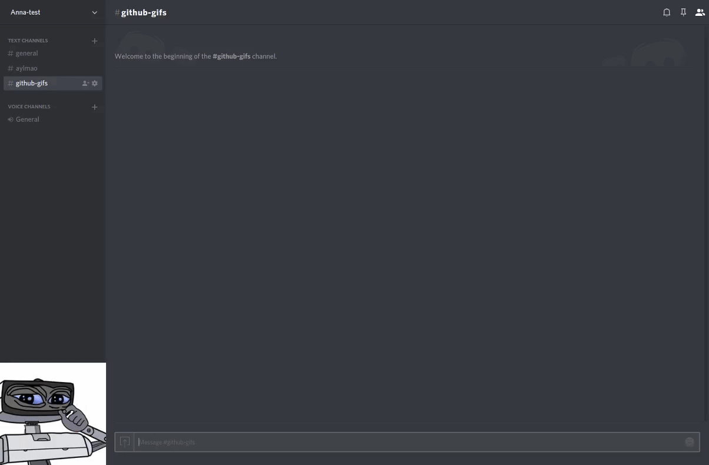
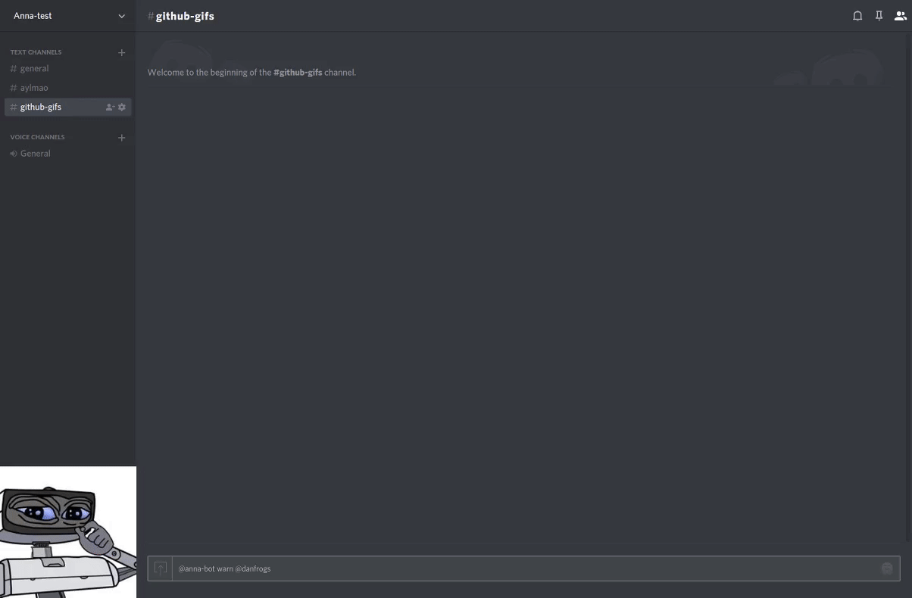
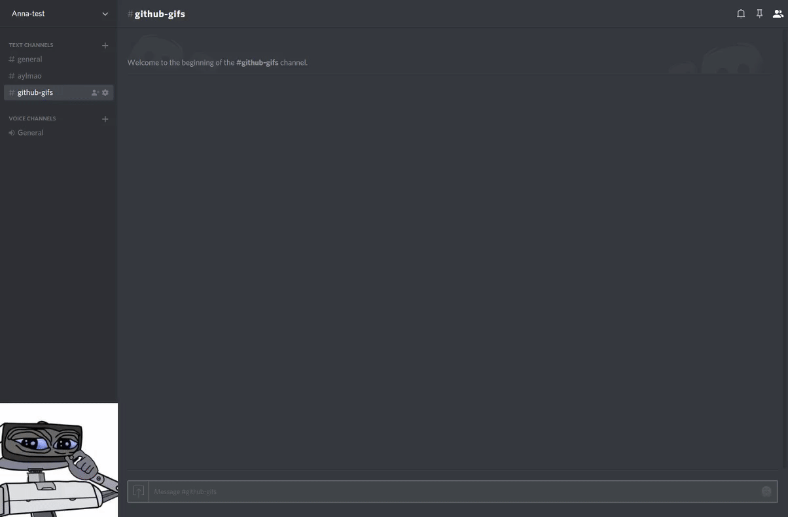
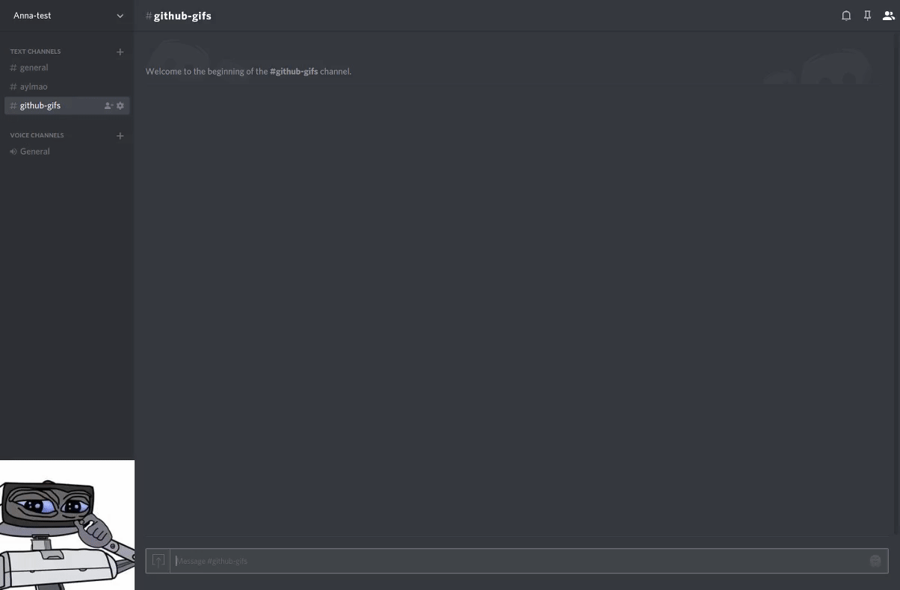
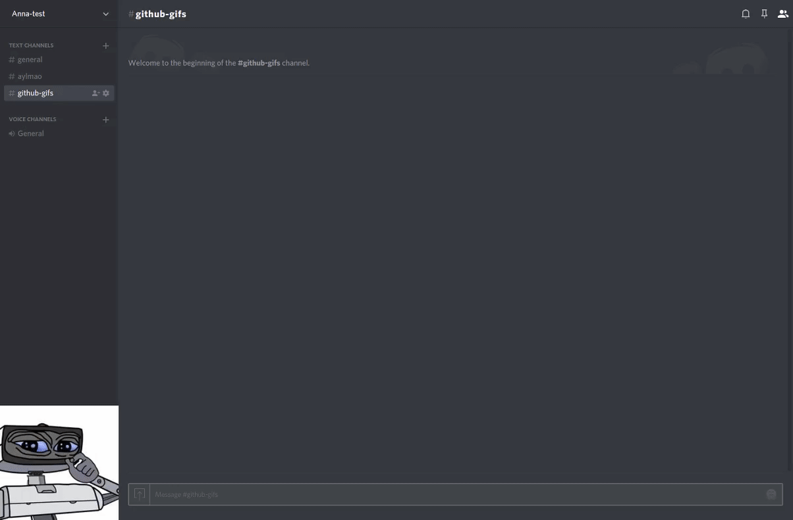
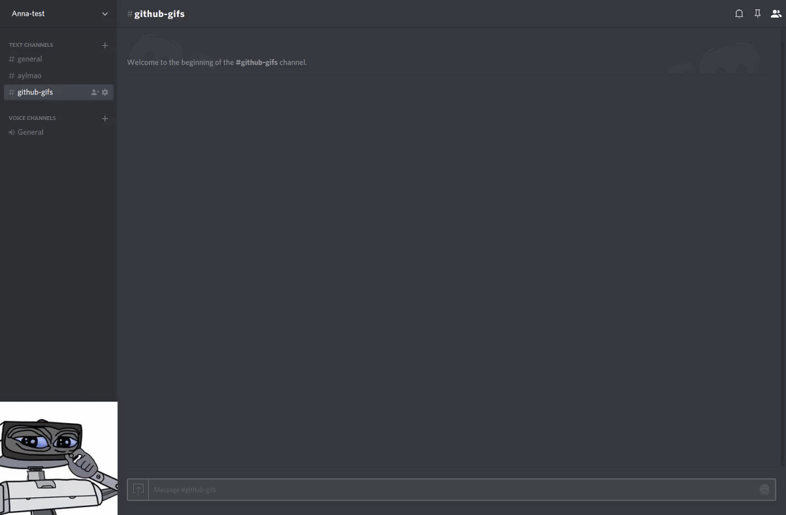
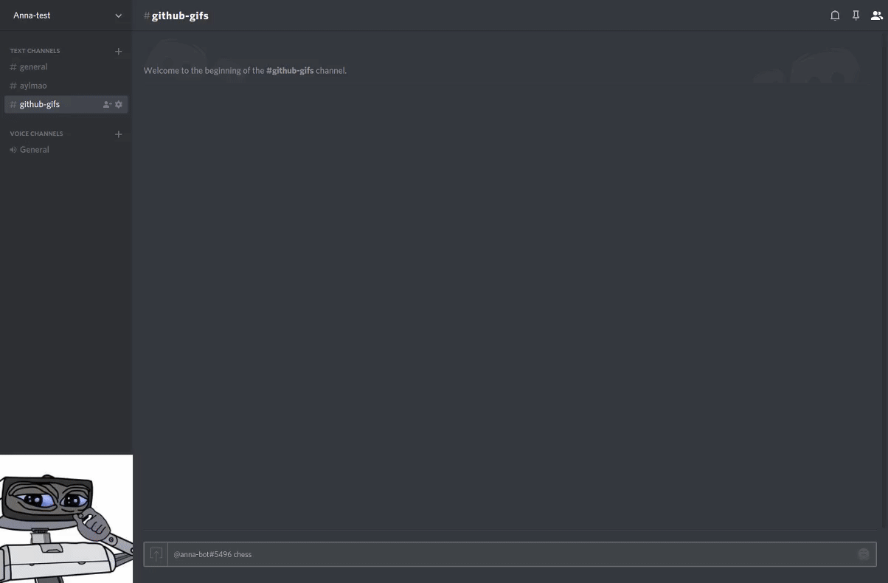
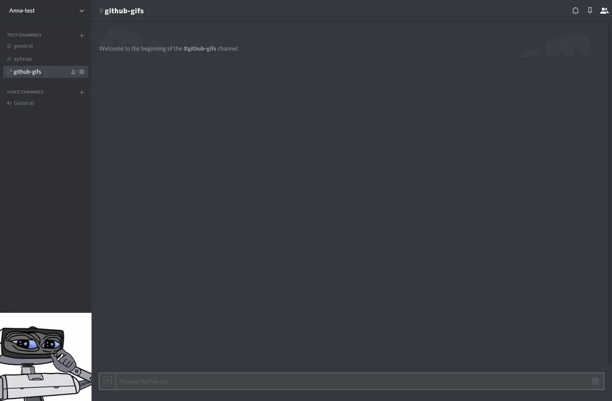
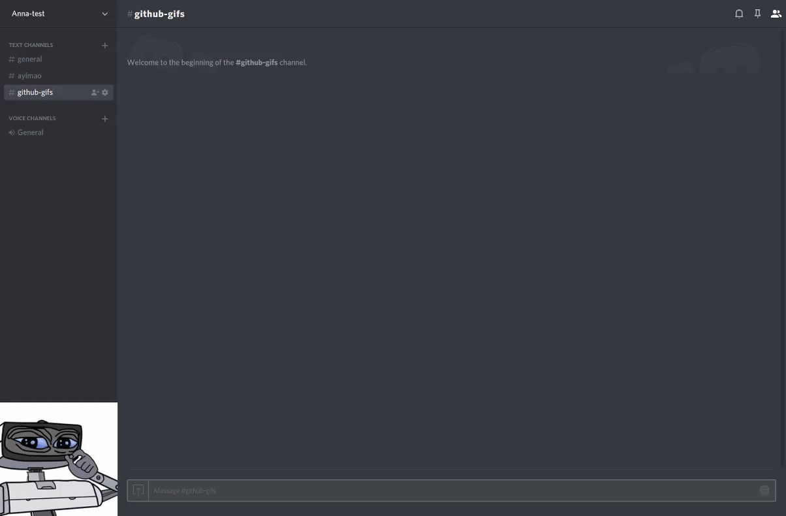

# Anna-bot

[](https://gitter.im/anna-bot/Lobby?utm_source=badge&utm_medium=badge&utm_campaign=pr-badge&utm_content=badge)
A discord bot created for the https://mcevalonia.com minecraft server's discord server, but usable by all discord servers.

## Some demonstrations











## How to run
### Dependencies:
This bot uses Python 3.5.

Install the package dependencies with pip (probably useful to be done in a virtualenv):
```
pip3.5 install -r requirements.txt
```

### Running it
1. Clone the repository
2. Create a discord bot account ([here](https://discordapp.com/developers/applications/me))
3. Create a [Mashape](https://market.mashape.com/register) account and retrieve an api key for the default application ([instructions](http://docs.mashape.com/api-keys#changing))
4. Edit `config.json`, don't forget to put in the bot account auth tokens and Mashape api key:)
5. Run `python3.5 anna_launcher.py` with appropriate flags (`python3.5 anna_launcher -sr` to run and restart if it exits for some reason)
6. Exit the bot and launcher with `CTRL+C`.

(Btw, the bot's name comes from a swedish pop song ;) )
